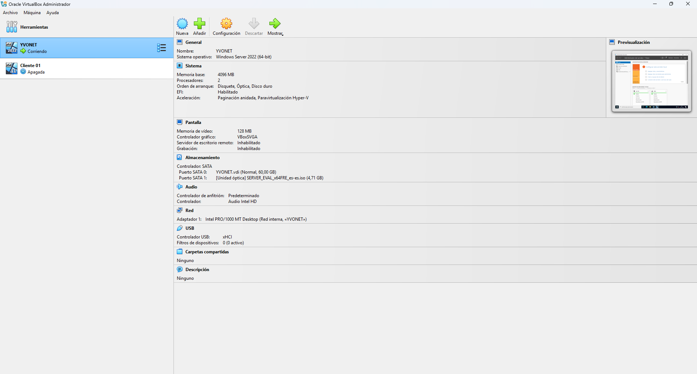
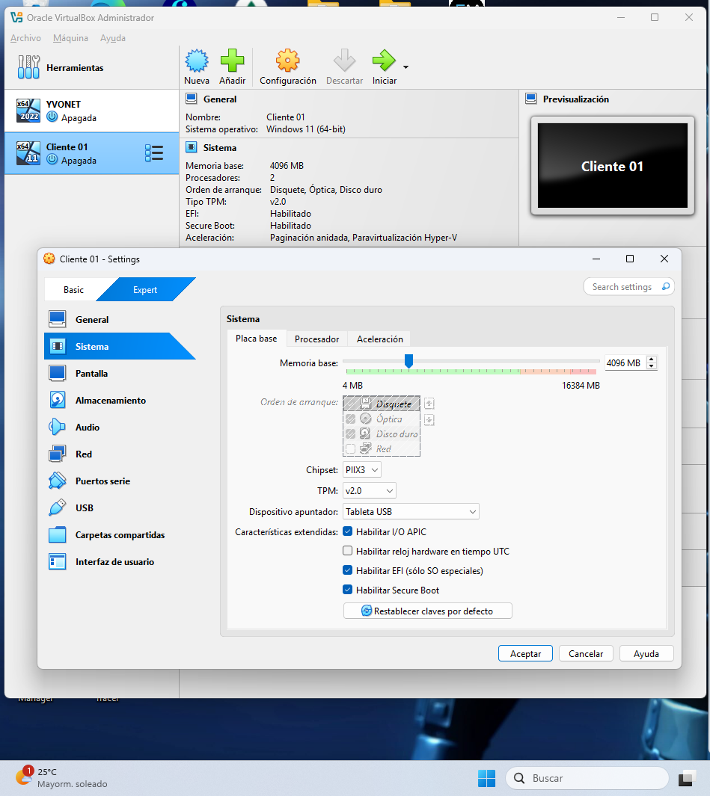

# Preparación del entorno

## Plataforma de virtualización

Para la creación del laboratorio YVONET se utilizó VirtualBox como plataforma de virtualización instalada sobre un equipo físico con Windows 11.

La virtualización permite simular una infraestructura empresarial completa utilizando máquinas virtuales independientes.

---

## Equipo anfitrión

Sistema operativo utilizado para alojar el laboratorio:

- Windows 11
- Oracle VirtualBox

Durante la preparación del entorno se detectó un conflicto relacionado con componentes de virtualización de Windows que afectaban al funcionamiento de VirtualBox.

Se revisaron las características de Windows y se deshabilitó la opción que estaba interfiriendo con el hipervisor de VirtualBox.

---

## Evidencia 1. Entorno virtual del laboratorio

La siguiente imagen muestra las máquinas virtuales creadas en Oracle VM VirtualBox para la implementación del laboratorio YVONET.



*Figura 1. Máquinas virtuales utilizadas en el laboratorio.*

---

# Máquinas virtuales del laboratorio

## Servidor: SVR-YVONET

Máquina virtual destinada a alojar la infraestructura principal del dominio.

Configuración:

- Sistema operativo: Windows Server 2022
- Nombre del equipo: SVR-YVONET
- Memoria RAM: 4 GB
- Procesadores asignados: 2 núcleos
- Almacenamiento: 80 GB

Funciones previstas:

- Controlador de dominio.
- Active Directory Domain Services.
- DNS.
- Gestión de usuarios y grupos.
- Recursos compartidos.

---

## Evidencia 2. Configuración de la máquina virtual Windows Server 2022


*Figura 2. Configuración de recursos asignados al servidor.*
---

## Cliente Windows 11

Máquina virtual utilizada para realizar pruebas de acceso al dominio y validación de permisos.

Configuración:

- Sistema operativo: Windows 11
- Memoria RAM: 4 GB
- Procesadores asignados: 2 núcleos
- Almacenamiento: 64 GB

Funciones:

- Unión al dominio YVONET.LOCAL.
- Inicio de sesión con usuarios del dominio.
- Pruebas de acceso a carpetas compartidas.
- Validación de permisos.

---

## Evidencia 3. Configuración asignada al equipo cliente Windows 11.



*Figura 3. Configuración de recursos asignados al equipo cliente.*

---

## Arquitectura del laboratorio
El laboratorio está compuesto por un equipo físico con Windows 11 que ejecuta VirtualBox como plataforma de virtualización.

Dentro de VirtualBox se han creado dos máquinas virtuales:

- Un servidor Windows Server 2022 que actúa como infraestructura principal del dominio.
- Un cliente Windows 11 utilizado para realizar pruebas de acceso, usuarios y permisos.

```text
Equipo físico
└── Windows 11
    └── VirtualBox
        ├── SVR-YVONET
        │   ├── Windows Server 2022
        │   ├── YVONET.LOCAL
        │   ├── Active Directory
        │   └── DNS
        │
        └── Cliente Windows 11
            └── Equipo unido al dominio
```
---

## Estado

Entorno virtual preparado para continuar con la instalación y configuración de servicios de infraestructura.
