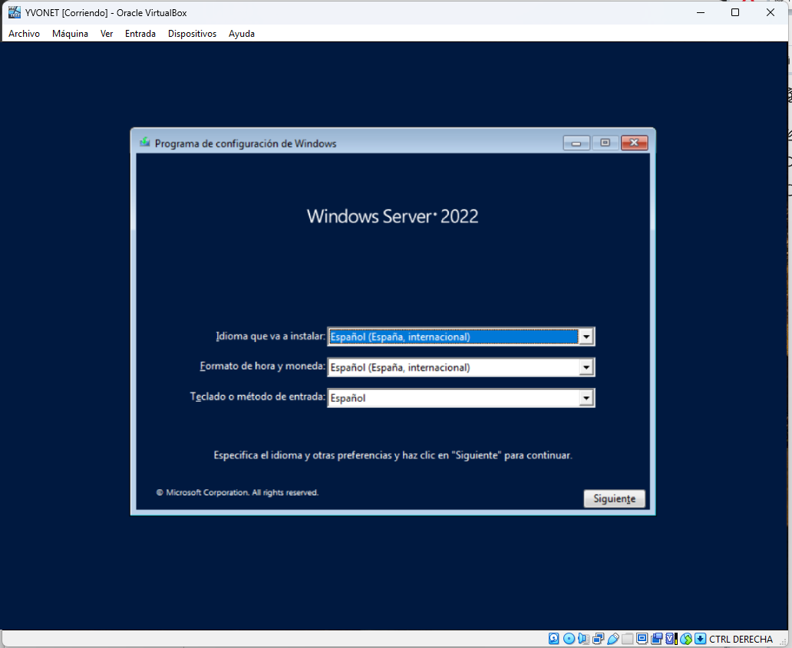
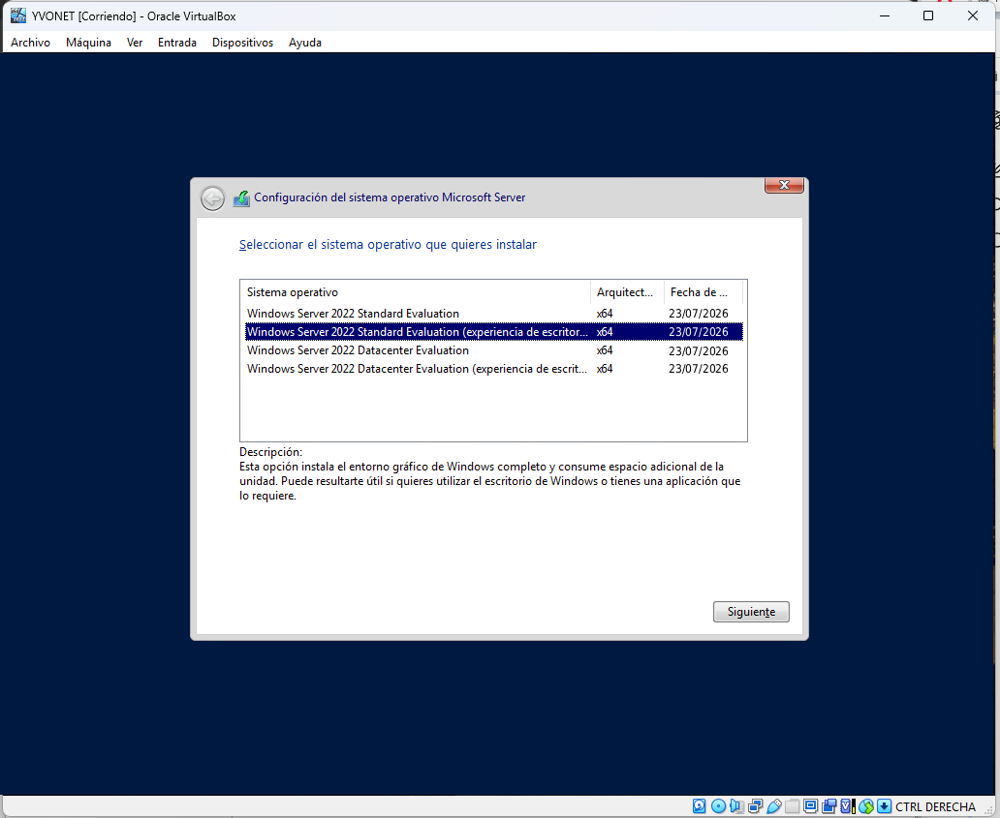
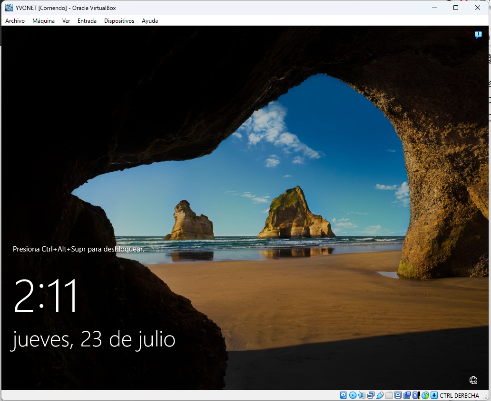
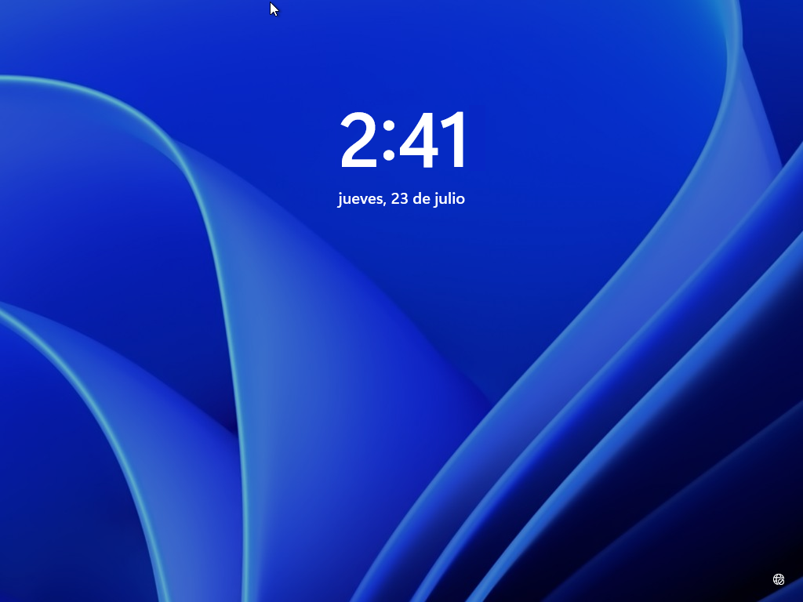

# 03. Instalación de los sistemas

## Introducción

En esta fase se realizó la instalación de los sistemas operativos que conforman la infraestructura del laboratorio **YVONET**. El objetivo fue disponer de un servidor con **Windows Server 2022** y un equipo cliente con **Windows 11**, los cuales servirán como base para la implementación de los servicios de red y administración del dominio.

Una vez finalizada la instalación de ambos sistemas operativos, se verificó su correcto funcionamiento antes de proceder con las configuraciones necesarias, las cuales se describen en el siguiente apartado.

---

# 1. Instalación de Windows Server 2022

La instalación de **Windows Server 2022** se realizó utilizando la imagen ISO oficial previamente configurada en la máquina virtual del servidor.

Durante el proceso de instalación se configuraron los parámetros básicos del sistema, como el idioma, el formato regional y la edición del sistema operativo.

### Configuración de idioma

Como primer paso del asistente de instalación, se seleccionaron el idioma, el formato de hora y moneda, y la distribución del teclado que se utilizarían durante el proceso.

*Figura 1. Selección del idioma.*

### Selección de la edición del sistema

A continuación, se seleccionó la edición de **Windows Server 2022** que sería utilizada para el desarrollo del laboratorio.

*Figura 2. Selección de la edición.*

### Finalización de la instalación

Una vez completado el proceso de instalación, el sistema operativo inició correctamente, quedando listo para su configuración en las siguientes fases del laboratorio.

*Figura 2. Primer inicio.*

---

# 2. Instalación de Windows 11

Posteriormente se realizó la instalación del sistema operativo **Windows 11** sobre la máquina virtual cliente.

Al igual que en el servidor, durante la instalación se configuraron los parámetros básicos del sistema antes de completar el primer inicio.

### Finalización de la instalación

Finalizada la instalación, el cliente inició correctamente y quedó preparado para las configuraciones que se realizarán en la siguiente fase.

*Figura 1. Primer inicio.*

---

# Resumen

En esta fase se completó la instalación de los sistemas operativos que forman parte de la infraestructura del laboratorio:

- Windows Server 2022.
- Windows 11.

Con ambos sistemas correctamente instalados, el siguiente paso consiste en realizar la configuración inicial de los equipos y la comunicación entre ellos mediante la red interna del laboratorio.
