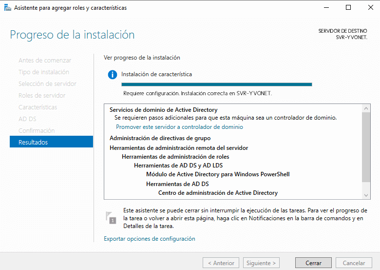
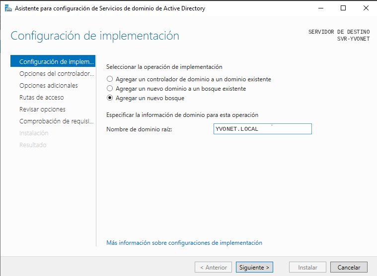

# 05. Active Directory Domain Services (AD DS)

## Instalación y configuración de Active Directory

### Introducción

Una vez finalizada la configuración inicial del servidor, se procedió a instalar y configurar el rol **Active Directory Domain Services (AD DS)**.

Este servicio permite administrar de forma centralizada usuarios, equipos, grupos y recursos dentro de una red empresarial mediante una estructura basada en dominios.

Para la infraestructura **YVONET**, el servidor **SVR-YVONET** será configurado como controlador de dominio principal utilizando el dominio:

---

# Instalación del rol AD DS

La instalación del servicio se realizó desde el **Administrador del servidor** mediante el asistente:

Durante el proceso se seleccionó el siguiente rol:

- **Active Directory Domain Services (AD DS)**

Durante la instalación también se añadieron automáticamente las herramientas de administración necesarias para la gestión del dominio.

<a href="../screenshots/05-active_directory.png">
  
</a>

*Figura 1. Instalación del rol Active Directory Domain Services.*

---

# Promoción del servidor a controlador de dominio

Una vez instalado el rol AD DS, el servidor fue promovido a **Controlador de Dominio**.

Al tratarse de una infraestructura nueva, se seleccionó la opción:

Como nombre del dominio se estableció:

---


Después de completar el asistente de configuración, el servidor pasó a ser el primer controlador de dominio de la infraestructura.

---

## Configuración del dominio

La configuración utilizada fue la siguiente:

| Parámetro | Valor |
|---|---|
| Dominio | YVONET.LOCAL |
| Servidor | SVR-YVONET |
| Tipo | Nuevo bosque |
| Rol instalado | Active Directory Domain Services |
| Servicio DNS | Instalado junto con AD DS |

<a href="../screenshots/05-nuevo_bosque.png">
  
</a>

*Figura 2. Creación del dominio.*


---

# Configuración del servicio DNS

Durante la promoción del servidor como controlador de dominio se instaló automáticamente el servicio **DNS**.

Este servicio es necesario para el funcionamiento de Active Directory, ya que permite resolver los nombres de los equipos y localizar los servicios del dominio.

Configuración generada:

| Parámetro | Valor |
|---|---|
| Servidor DNS | SVR-YVONET |
| Dirección IP DNS | 192.168.10.10 |
| Zona DNS | YVONET.LOCAL |

La zona DNS creada permitirá la comunicación entre los equipos pertenecientes al dominio.

---

## Captura de la zona DNS

**Imagen 05.3 - Zona DNS del dominio YVONET.LOCAL**


---

# Reinicio del servidor

Después de finalizar la promoción del servidor a controlador de dominio, el sistema se reinició automáticamente para aplicar la nueva configuración.

A partir de este momento, el inicio de sesión del servidor pasó a realizarse utilizando las credenciales del dominio **YVONET.LOCAL**.

---

# Comprobaciones realizadas

Tras completar la instalación y configuración de Active Directory se realizaron las siguientes comprobaciones:

- Verificación de la correcta instalación de Active Directory.
- Comprobación del funcionamiento del servicio DNS.
- Acceso a las herramientas administrativas del dominio.
- Verificación del correcto funcionamiento del controlador de dominio.
- Comprobación de la autenticación dentro del dominio.

---

# Comandos utilizados

## Información de red

```cmd
ipconfig /all
