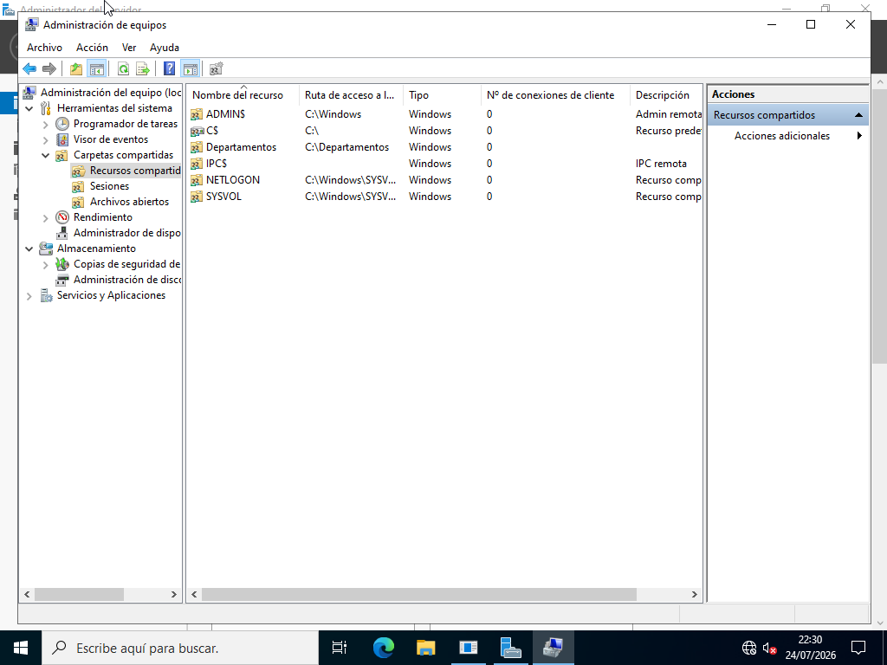
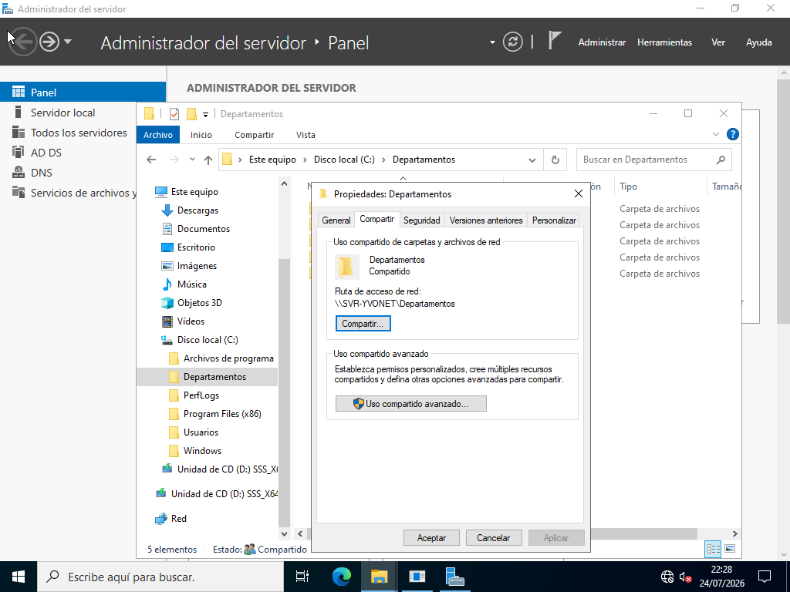
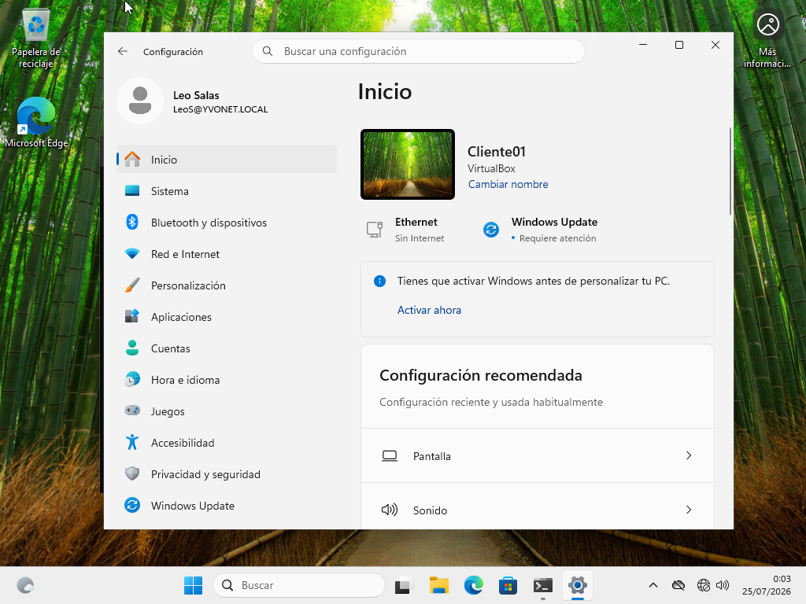
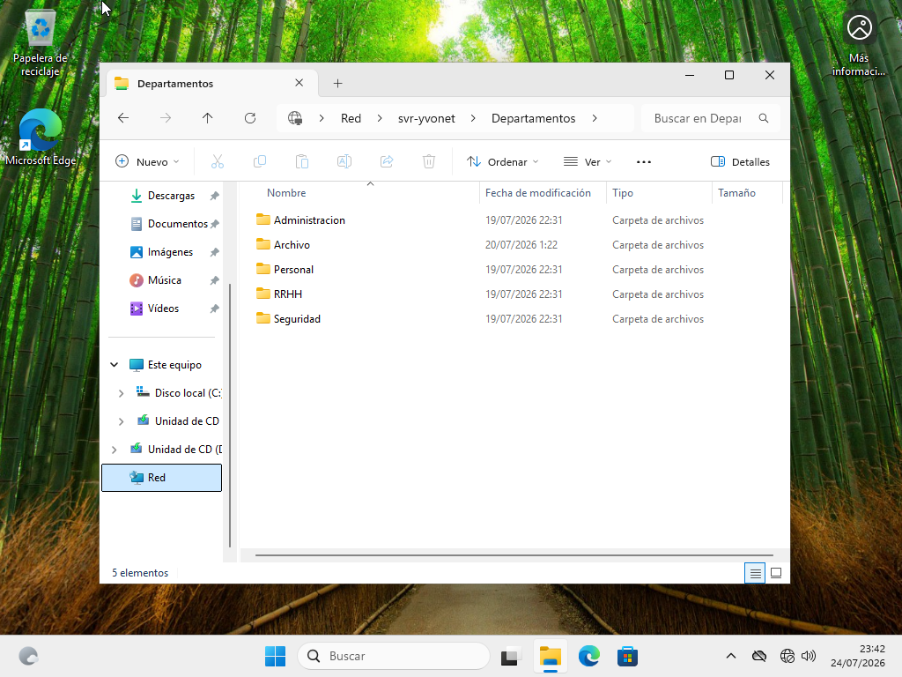

# Recursos compartidos

## Introducción

Una vez creada la estructura del dominio y configurados los usuarios de la empresa YVONET, se procedió a la creación de los recursos compartidos que serían utilizados por los distintos departamentos.

Los recursos compartidos permiten que varios usuarios puedan acceder a la misma información desde diferentes equipos conectados a la red corporativa, facilitando la organización y gestión de los archivos dentro del dominio.

---

## Objetivo

Crear una estructura organizada de carpetas compartidas para cada departamento de la empresa y preparar el entorno para la posterior asignación de permisos NTFS.

---

## Procedimiento

Se creó una carpeta principal destinada a almacenar los recursos compartidos de los departamentos:

```text
C:\Departamentos
```

Dentro de esta carpeta se creó la siguiente estructura:

```text
Departamentos
│
├── Archivo
├── Personal
├── Seguridad
├── Administración
└── RRHH
```

Posteriormente se compartió la carpeta **Departamentos** para permitir el acceso desde los equipos pertenecientes al dominio.

<a href="../screenshots/08-adm_carpetas_compartidas.png">
  
</a>

---

Visualización del recurso compartido creado dentro de la administración del servidor.

<a href="../screenshots/08-propiedades_carpeta_compartida.png">
  
</a>

---

Demostración que el recurso compartido funciona desde un equipo cliente del dominio, no solo desde el servidor.

<a href="../screenshots/08-usuario_conectado.png">
  
</a>

** Inicio de sesión del usuario Leo en el equipo cliente 01 ** 

<a href="../screenshots/08-acceso_desde_cliente.png">
  
</a>

** Acceso al recurso compartido desde el cliente 01 ** 

---

## Herramientas utilizadas

- Explorador de archivos de Windows
- Server Manager
- Administración de carpetas compartidas

---

## Comandos utilizados

Durante este procedimiento no fue necesario utilizar comandos desde la consola.

Toda la configuración se realizó mediante las herramientas gráficas de Windows Server.

#### **Nota:** Aunque la configuración se realizó mediante la interfaz gráfica de Windows Server, la administración de recursos compartidos también puede realizarse mediante PowerShell, una opción habitual en entornos empresariales.
---

## Resultado

La infraestructura quedó preparada para que los distintos departamentos pudieran acceder a los recursos compartidos una vez configurados los permisos correspondientes.
